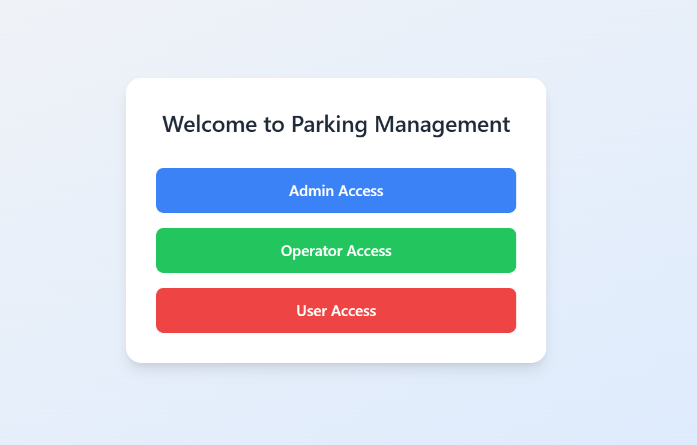
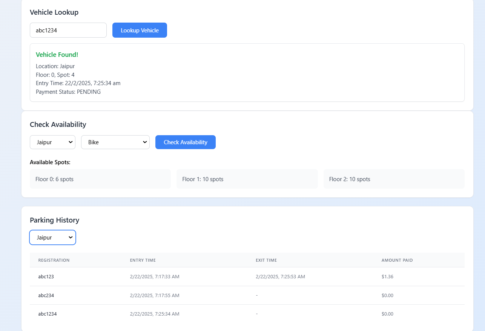
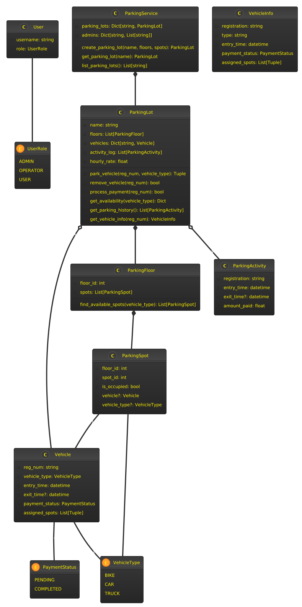
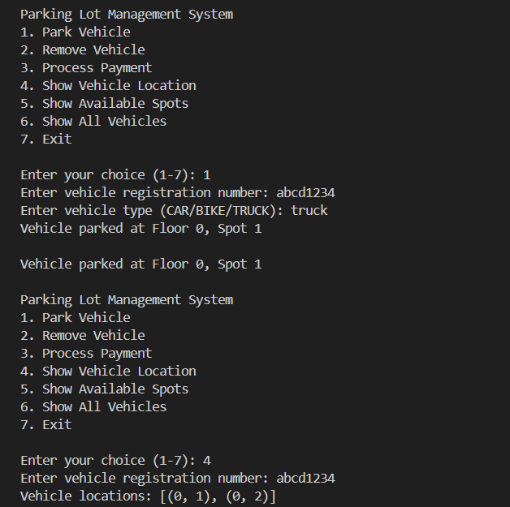

# 🚘 Parking Lot Management System (Final Iteration)

[](https://srkathal-parking-lot-system.vercel.app/)
[](https://github.com/SaranshOp/Parking-Lot-System-Garage)

Demo Videos on Loom: ( there is a limit of time so I had to make 2 videos ).  
Watch at 1.5x speed for better experience.

[](https://www.loom.com/share/a59e2082629f469f9e19a3fb8c381afd?sid=27efa5ca-6ec0-4031-959c-217225d565f9)
[](https://www.loom.com/share/d24c8b6ffa4c45b4a282fd13d8346251?sid=52ebec37-cf0a-40e0-97c3-347d0017d0cf)

## 📖 Overview

The **Parking Lot Management System** is a feature-rich web application designed to manage parking lots efficiently. Built using **TypeScript** and **NextJs**, this project is my third iteration in a series of parking management systems evolving from my previous implementations in **Python** and **FastAPI**. This project introduces **role-based access control, dynamic UI updates, multi-lot management, vehicle history tracking, and advanced querying**—all built on top of the original assignment requirements.

---





---

## UML diagrams



[Deployed Project](https://srkathal-parking-lot-system.vercel.app/)

This project builds upon the foundational concepts of earlier **Project 1 & 2**, which focused on object-oriented programming principles and iterative experimentation. This is my **third iteration**, following a structured learning approach:

1. **First Iteration** - Focused on understanding functional requirements and implemented as a **CLI-based system**.
2. **Second Iteration** - Built with **FastAPI and JavaScript** for a basic web-based version.
3. **Final Iteration** - Fully transitioned to **Next.js + TypeScript** with an intuitive UI and enhanced feature set.

---

## 🚀 Key Features

### 🎭 Role-Based Access Control

The system now supports three distinct roles with **varying levels of control**:

- **Admin**:

  - Create and manage multiple parking lots.
  - View and analyze the **history of incoming and outgoing vehicles**.
  - Access all operator functionalities.

- **Operator**:

  - Park vehicles dynamically based on type (Bike, Car, Truck).
  - Process payments and handle vehicle exits.

- **User**:

  - Query available spots **per parking lot and per vehicle type**.
  - Lookup vehicle locations using registration numbers.

---

#### 🏢 Multi-Lot Parking Management

- **Admins can create multiple parking lots**, each with its own floors and spot distribution.
- **Users can query lots based on location and availability**.

---

#### 🚘 Vehicle Operations & Tracking

1. **Real-time Vehicle Parking**:

   - Vehicles are assigned to the **nearest available spot**.
   - Operators can easily park and exit vehicles via an interactive UI.

2. **History & Audit Logs**:

   - **Admins can track all vehicle movements**, including entry/exit timestamps.
   - Payment and duration records are maintained per vehicle.

3. **Querying**:

   - Users can filter by **lot, vehicle type, and availability**.
   - Vehicles can be located using **registration numbers**.

---

#### 📊 Real-Time Tracking & Availability

- **Admins and users can check live floor-wise availability**.
- **Operators receive real-time updates on parking space utilization**.
- **Quick search functionality** allows users to locate their parked vehicles.

---

## 🗒 Assignment Requirements Fulfilled

✔️ **Multiple floors & spots** per parking lot. <br>
✔️ **Different vehicle types & space allocation** (Bike = 1, Car = 1, Truck = 2 consecutive spots).<br>
✔️ **Nearest available spot assignment** for parking.<br>
✔️ **Vehicle exit & payment processing**.<br>
✔️ **Querying available spots and vehicle location**.<br>
✔️ **Concurrency handling** using event loops and locks.<br>

---

### 🕒 Parking History

Admins can view a detailed history of all parked vehicles, including:

- Entry/exit times
- Payment records
- Vehicle registration details

---

## 💻 Tech Stack

- **Frontend**: Next.js, TypeScript, Tailwind CSS
- **Backend (Previous Version)**: FastAPI, Python
- **Concurrency Management**: AsyncIO (Python), Next.js API routes
- **State Management**: React Context API / Zustand
- **Database (Future Scope)**: PostgreSQL or Firebase

---

## 🎨 UI Evolution (Screenshots)

### CLI-Based Version (First Iteration)



### FastAPI + JavaScript (Second Iteration)

###### Dashboard (Admin View)


### Next.js + TypeScript (Final Version)

## 

## 🏠 Installation & Setup

### Running the Next.js Version (Final Iteration)

1. Clone the repository:
   ```sh
   git clone [repository-url]
   cd nextjs-deployed
   ```
2. Install dependencies:
   ```sh
   npm i
   ```
3. Run the development server:
   ```sh
   npm run dev
   ```
4. Open [http://localhost:3000](http://localhost:3000)[ in you](http://localhost:3000)r browser.

### Running the FastAPI Version (Second Iteration)

1. Navigate to the FastAPI folder:
   ```sh
   cd Project2
   ```
2. Install dependencies:
   ```sh
   pip install -r requirements.txt
   ```
3. Run the API:
   ```sh
   cd src
   uvicorn api:app --reload
   ```
4. Open [http://127.0.0.1:8000/docs](http://127.0.0.1:8000/docs)[ to test](http://127.0.0.1:8000/docs) API endpoints.

### Running the CLI Version (First Iteration)

1. Navigate to the CLI-based project directory:
   ```sh
   cd project/src
   ```
2. Run the CLI script:
   ```sh
   python CLI.py
   ```

<<<<<<< HEAD
#### Some other technichal information of project at the [ReadMe2.md](ReadMe2.md) file.
=======
## Some other Technichal info at the [ReadMe2.md](ReadMe2.md) file.
>>>>>>> 9c5f1469bc498bf311834adb633672e564ec5c63

---
